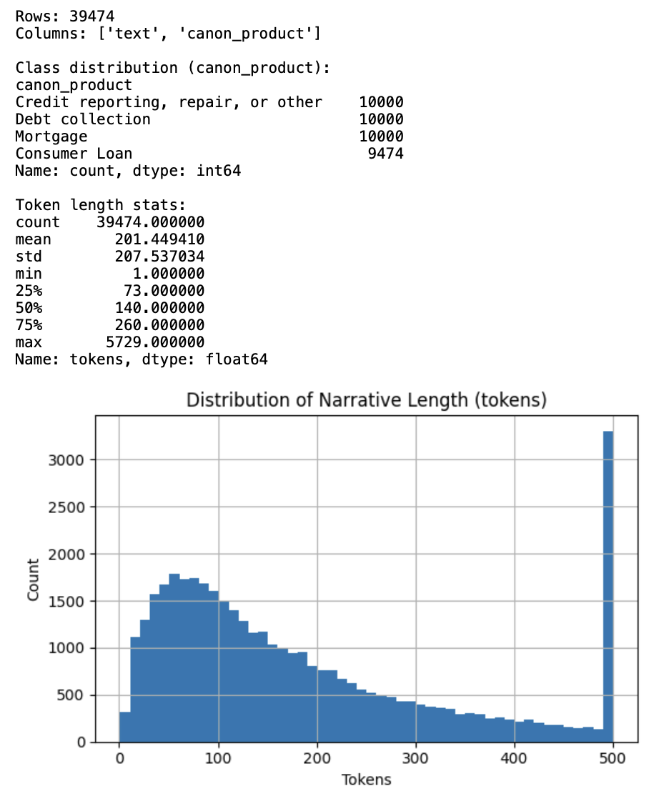

# Consumer Complaint Text Classification

## Project Overview

This project implements a multi-class text classification system to categorize consumer complaints from the Consumer Complaint Database into 4 distinct categories:

- **0**: Credit reporting, repair, or other
- **1**: Debt collection
- **2**: Consumer Loan
- **3**: Mortgage

The project follows a comprehensive machine learning pipeline including data preparation, exploratory analysis, text preprocessing, model selection, evaluation, and prediction.

## Dataset

**Source**: Consumer Complaint Database from [data.gov](https://catalog.data.gov/dataset/consumer-complaint-database)

**Original Dataset**: Contains consumer complaints with various product categories
**Processed Dataset**: Balanced dataset with ~10,000 samples per class (39,474 total samples)

## Project Structure

```
task-5/
├── data/
│   ├── ccdb_balanced.csv          # Balanced dataset for training
│   └── rows.csv                   # Additional data files
├── artifacts/
│   ├── best_model.joblib         # Trained Logistic Regression model
│   ├── tfidf.joblib              # TF-IDF vectorizer
│   └── training_data_sample.csv  # Sample training data
├── Task5_Dataset_Preparation.ipynb  # Data preprocessing notebook
├── Task5_Text_Classification.ipynb  # Main classification notebook
└── README.md                     # This file
```

## Implementation Pipeline

### 1. Dataset Preparation (`Task5_Dataset_Preparation.ipynb`)

**Steps Completed:**

- ✅ Loaded raw Kaggle consumer complaints dataset
- ✅ Performed exploratory data analysis (EDA)
- ✅ Selected relevant features (Product, Consumer complaint narrative)
- ✅ Mapped Product values to 4 canonical categories
- ✅ Balanced dataset with equal samples per class (~10,000 each)
- ✅ Cleaned and saved balanced dataset


**Key Features:**

- Handles missing narratives by dropping incomplete records
- Maps various product names to standardized categories
- Creates balanced dataset for fair model training

### 2. Text Classification (`Task5_Text_Classification.ipynb`)

**Steps Completed:**

#### 2.1 Exploratory Data Analysis & Feature Engineering

- ✅ Analyzed class distribution (balanced ~10,000 samples per class)
- ✅ Computed text length statistics (mean: 201 tokens, max: 5,729 tokens)
- ✅ Generated token length distribution visualization



#### 2.2 Text Pre-Processing

- ✅ Implemented comprehensive text cleaning:
  - Convert to lowercase
  - Remove URLs and web links
  - Remove non-alphabetic characters
  - Normalize whitespace
- ✅ Filtered out texts with less than 4 tokens
- ✅ Final dataset: 39,463 samples after cleaning

#### 2.3 Model Selection & Comparison

- ✅ Implemented 5 different classification models:
  - Linear SVM
  - Logistic Regression
  - Naive Bayes
  - Random Forest
  - SGD Classifier
- ✅ Used TF-IDF vectorization (5,000 features, 1-2 n-grams)
- ✅ Train-test split (80-20) with stratification

#### 2.4 Model Performance Comparison

- ✅ Evaluated all models using:
  - Accuracy
  - F1-score (macro and weighted)
  - Classification reports
- ✅ **Best Model**: Logistic Regression with 85.01% accuracy


#### 2.5 Model Evaluation

- ✅ Detailed classification report for best model:
  - Credit reporting: 82.71% F1-score
  - Debt collection: 81.48% F1-score
  - Consumer Loan: 83.07% F1-score
  - Mortgage: 92.64% F1-score
- ✅ Generated confusion matrix visualization
- ✅ Overall macro F1-score: 84.98%


#### 2.6 Prediction & Model Persistence

- ✅ Saved trained model and vectorizer as artifacts
- ✅ Implemented prediction function for new text
- ✅ Demonstrated inference on sample complaints

## Model Performance Results

| Model                   | Accuracy   | F1-Macro   | F1-Weighted |
| ----------------------- | ---------- | ---------- | ----------- |
| **Logistic Regression** | **85.01%** | **84.98%** | **85.00%**  |
| Linear SVM              | 84.67%     | 84.65%     | 84.66%      |
| SGD Classifier          | 84.52%     | 84.50%     | 84.51%      |
| Random Forest           | 82.15%     | 82.12%     | 82.13%      |
| Naive Bayes             | 81.23%     | 81.20%     | 81.21%      |

## Key Technical Details

### Text Preprocessing Pipeline

```python
def clean_text(s: str) -> str:
    s = str(s).lower()
    s = re.sub(r"http\S+|www\.\S+", " ", s)  # Remove URLs
    s = re.sub(r"[^a-z\s]", " ", s)          # Keep only letters and spaces
    s = re.sub(r"\s+", " ", s).strip()       # Normalize whitespace
    return s
```

### Feature Engineering

- **TF-IDF Vectorization**: 5,000 features with 1-2 n-grams
- **Text Length Analysis**: Mean 201 tokens, filtered minimum 4 tokens
- **Class Balancing**: Equal representation across all 4 categories

### Model Architecture

- **Best Model**: Logistic Regression with L2 regularization
- **Vectorization**: TF-IDF with max_features=5000, ngram_range=(1,2)
- **Train/Test Split**: 80/20 with stratification

## Usage Instructions

### Prerequisites

```bash
pip install pandas numpy matplotlib scikit-learn joblib
```

### Running the Notebooks

1. **Data Preparation**: Run `Task5_Dataset_Preparation.ipynb` first
2. **Classification**: Run `Task5_Text_Classification.ipynb`

### Making Predictions

```python
import joblib

# Load saved artifacts
model = joblib.load('artifacts/best_model.joblib')
tfidf = joblib.load('artifacts/tfidf.joblib')

# Predict new text
def predict_complaint(text):
    cleaned = clean_text(text)
    X = tfidf.transform([cleaned])
    prediction = model.predict(X)[0]
    return ID_TO_CANON[prediction]

# Example usage
complaint = "The mortgage company charged me incorrect fees"
category = predict_complaint(complaint)
print(f"Predicted category: {category}")
```

## Results Summary

- **Dataset Size**: 39,463 consumer complaints
- **Classes**: 4 balanced categories
- **Best Model**: Logistic Regression
- **Accuracy**: 85.01%
- **Macro F1-Score**: 84.98%
- **Best Performing Category**: Mortgage (92.64% F1-score)
- **Most Challenging Category**: Debt collection (81.48% F1-score)

## Screenshots Included

The following screenshots have been added to demonstrate key aspects of the implementation:

### ✅ Added Screenshots

- **Class Distribution**: Shows balanced dataset with ~10,000 samples per category
- **EDA Results**: Exploratory data analysis showing dataset characteristics
- **Model Comparison**: Performance comparison of all 5 classification models
- **Best Model Performance**: Detailed evaluation metrics for Logistic Regression

### Additional Screenshots (Optional)

To further enhance documentation, consider adding:

- **Token Length Distribution**: Histogram showing narrative length distribution
- **Confusion Matrix**: Visual representation of model predictions vs actual labels
- **Demo Predictions**: Sample text predictions showing model inference
- **Code Implementation**: Key functions and model training code

## Future Improvements

1. **Advanced Preprocessing**: Implement lemmatization and stemming
2. **Feature Engineering**: Add text length, sentiment analysis features
3. **Model Enhancement**: Try deep learning models (BERT, RoBERTa)
4. **Hyperparameter Tuning**: Grid search for optimal parameters
5. **Cross-Validation**: Implement k-fold validation for robust evaluation

## Conclusion

This project successfully demonstrates a complete text classification pipeline for consumer complaints. The Logistic Regression model achieved 85% accuracy with balanced performance across all categories. The implementation includes proper data preprocessing, model comparison, evaluation metrics, and production-ready prediction capabilities.

The included screenshots provide visual evidence of the key steps in the pipeline, from data preparation through model evaluation, making this a comprehensive documentation of the text classification project.

---

**Project completed as part of Kaiburr Task 5 - Data Science Text Classification**
